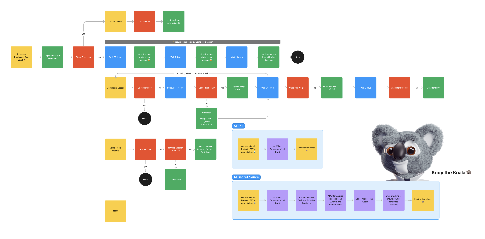

# Skill Recordings Course Builder POC

This is an application that is primarily meant to be ran locally (for now) 
as a way to explore and experiment with gpt-4 prompt chaining as a "tool for 
thought"""

Current State: https://www.loom.com/share/651287e8136a46429f46e6541e3dd0c2

## TODO

It's got a lot of moving parts 😅:

- A database to store our data
- An ORM to interact with our database
- Authentication
- Serverless Queueing
- Email sending
- Websockets
- CMS

As a basis we used [T3 Stack](https://create.t3.gg/) to bootstrap the 
project using the NextAuth.js, Tailwind, tRPC, and Drizzle options.

Drizzle is going to use Planetscale as the database, which will allow us to 
leverage edge functions.

We are using the Next.js app router. We also need email so we will use 
Resend and react-email.

Additionally, we are going to use Sanity.io for our CMS. This will allow us
to create a simple CMS for defining dynamic chaining workflows and other things.

This is kind of a chore, but it's not too bad. We need to set up accounts
with:

- [Planetscale](https://planetscale.com/)
- [Stripe](https://stripe.com/)
- [Resend](https://resend.io/)
- [Sanity](https://sanity.io/)

## Getting Started

The primary goal of the app is to demonstrate how to use Inngest to generate 
chained conversations with GPT-4. This approach is useful for creating 
higher quality generated text that is acceptable to use for customer 
communications. It's also interesting for processing text and general 
exploration in the gpt-4 space.

Here's an example from a production application that's using this approach:

Various events in the application trigger async workflows that occur in 
queued serverless background jobs. 

* an event is received
* steps/actions are performed
* we can sleep or wait for other events within the workflow
* we can send events that trigger other workflows

## Event-Driven Workflows

The application is built around the concept of event-driven workflows. There 
are several kinds of events. The primary events are external to the workflow 
and are emitted from users interacting with the application. The user has 
requested work and provided input. When these are received, the workflow 
kicks into gear and begins processing the request.

There are also external events that are generally received via webhooks when 
some service provider has completed some work. For example, [when a video is
uploaded to Mux, they send a series of webhooks](https://docs.mux.com/guides/system/listen-for-webhooks) at various staging in the 
video processing to let us know when the asset is available.

The receiving URL is configured within the Mux dashboard (not, for local 
development we use [ngrok](https://ngrok.com/) to expose our local server.

Another example is ordering transcripts from Deepgram. When the video is 
uploaded we send the URL to Deepgram for transcription and include a 
callback url for Deepgram to contact when the transcript is ready.

The last kind of event is internal to the workflow. These are events that
are triggered by the workflow itself. 

* `VIDEO_UPLOADED_EVENT`: triggered when a new video has been uploaded and 
  is available via a URL.

_[more to come]_
